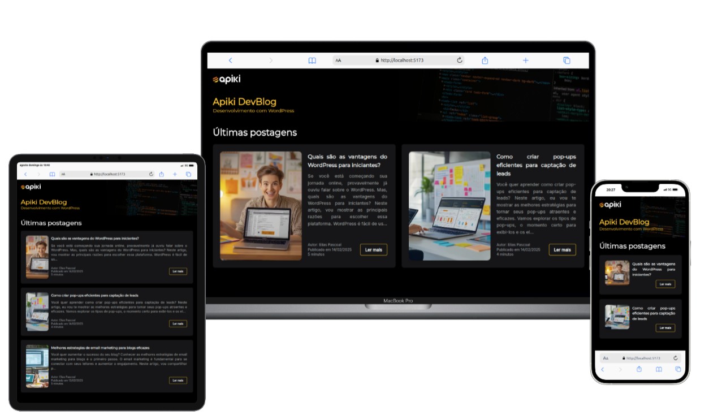

# Desafio - Blog Apiki focado em Desenvolvimento

Esse projeto é um desafio para avaliar as habilidades com **HTML**, **React**, **Tailwind CSS**, **Javacript** e **logica de programação**, onde ele mostra as publicações do blog Apiki da aba de Desenvolvimento.
Com proposito de oferecer uma interface moderna e responsiva para que gosta desde tipo de conteúdo.

---

## 🖼️ Preview

<div style="display: flex; gap: 12px; flex-wrap: wrap; justify-content: center;">
  
</div>

---

## 🚀 Tecnologias Utilizadas


---

## 📸 Funcionalidades

- ✅ Listagem dos artigos da aba **Desenvolvimento** através da API WordPress
- ✅ Pagina individual formatada, com **Nome do autor**, **Data de publicação** e **Tempo estimado de leitura**
- ✅ Layout 100% **responsivo**
- ✅ Navegação utilizando **React Router**
- ✅ Carregamento de mais artigos com botão **"Carregar mais"**
- ✅ Estilização com **Tailwind CSS**

---

## 📦 Instalação e uso

```bash
# Clone o repositório
git clone https://github.com/gaby-mvi/Apiki-blog.git

# Acesse o diretório
cd Apiki-blog

# Instale as dependências
npm install

# Inicie o servidor de desenvolvimento
npm run dev
```
---
